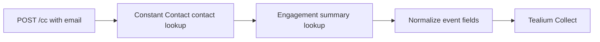
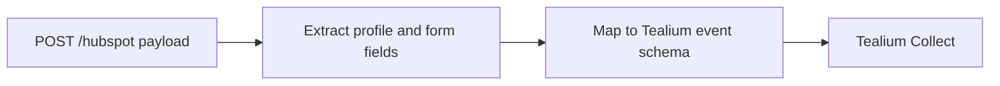

# HubSpot and Constant Contact to Tealium Prototype

Historical Node/Express integration prototype for normalizing marketing-system data and forwarding it to Tealium Collect.

This repository began from an AWS CodeStar service scaffold. The implemented application is a small integration layer with two routes:

- `POST /cc` looks up a Constant Contact contact, retrieves engagement summary data, and posts the resulting profile event to Tealium.
- `POST /hubspot` accepts a HubSpot-style form/profile payload, maps selected fields, and forwards a normalized event to Tealium.

## What This Demonstrates

- Webhook-style ingestion from marketing and CRM systems.
- Third-party API lookup and enrichment with Constant Contact.
- Payload mapping from HubSpot form data into an event-collection schema.
- Tealium Collect forwarding for customer-profile activation.
- Practical integration-framework work across GTM and customer-data platforms.

## Data Flows





## Configuration

The original prototype used inline placeholder constants in `app.js`:

- Tealium account/profile
- Constant Contact API key and bearer token
- Visitor-id prefixes/suffixes

Before any real deployment, move these values to environment variables, add request validation, and remove any customer-specific field assumptions.

## Running Locally

```bash
npm install
npm test
```

The existing tests came from the AWS scaffold and do not cover the integration routes. This repository should be treated as a historical prototype unless route tests, dependency updates, and error-handling improvements are added.

## Repository Status

This is not production software. Its portfolio value is the integration pattern: ingest customer/marketing events, enrich or map them, and forward structured data into a customer-data platform for activation.
